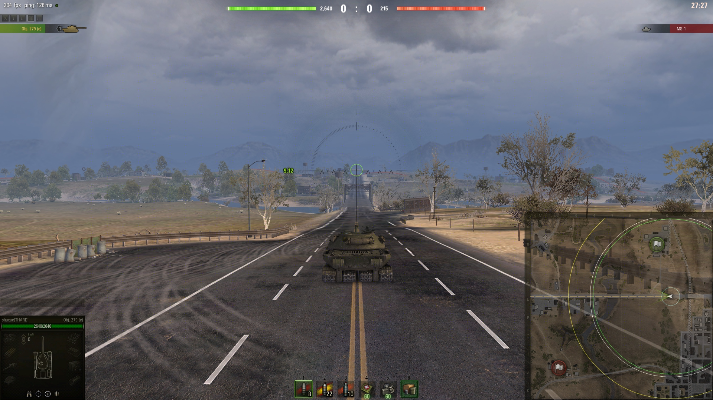
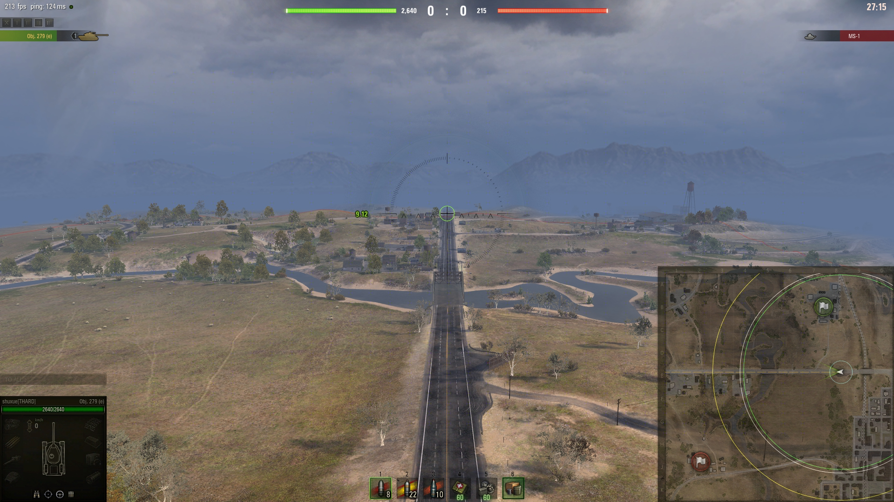
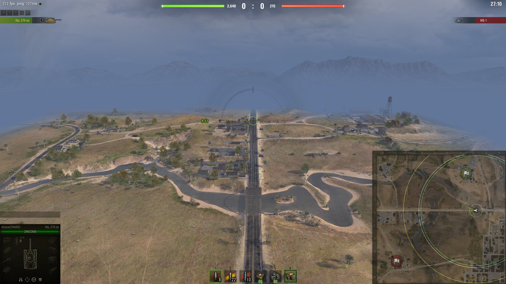

# Reworked Camera

	&bull; <a href="#en">EN</a> &bull; <a href="#ru">RU</a> 

## EN

**Not compatible with [Reworked Exit CommanderCam](../reworkedexitcommandercam/) mod**

### Mod description

**CommanderCam** = Tactical View

- Reworked **CommanderCam**

There are 4 variants in the archive, they differ only in the return values for **xZoom**: x2, x4, x8;

**Zooms**: x1, x2, x4, x8, x16, x25, x50;

1. **[R]Camera** = x50 >>> x25 >>> x16 >>> x8 >>> x4 >>> x2 >>> x1
2. **[R]Camera_x2** = x50 >>> x2; x25 >>> x2; x16 >>> x2; x8 >>> x2; x4 >>> x2; x2 >>> x1;
3. **[R]Camera_x4** = x50 >>> x4; x25 >>> x4; x16 >>> x4; x8 >>> x4; x4 >>> x2; x2 >>> x1;
4. **[R]Camera_x8** = x50 >>> x8; x25 >>> x8; x16 >>> x8; x8 >>> x4; x4 >>> x2; x2 >>> x1;

### Compatibility

This mod should be compatible with almost everything:

- For mod **PMOD** by default
  - if you use it **PMOD** together with **Reworked Camera**, **PMOD** will have priority in the settings. For **Reworked Camera** to work as intended, you must turn off the module: `zoomDistance.json`.
  **or**  
  - If you install **PMOD** from modpacks, there may be other modules included, for example: `zoomX.json`, `scrollSensitivity.json` or other modules.

Reworked the logic of camera work in battle

  

  

  

  

  

## RU

**Не совместим с модом [Reworked Exit CommanderCam](../reworkedexitcommandercam/)**

Переработана логика работы камеры в бою

  

  

  

  

  

